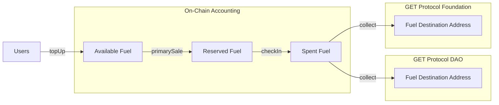
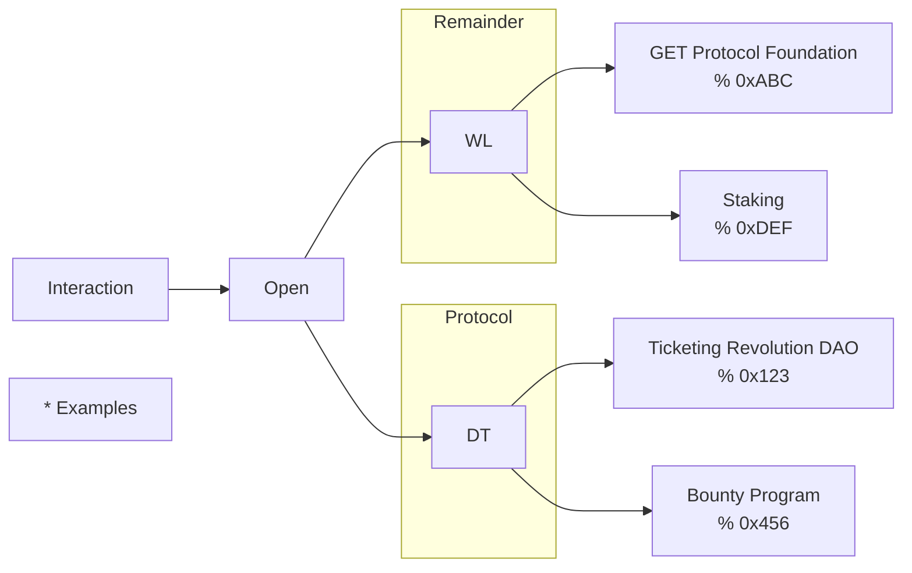
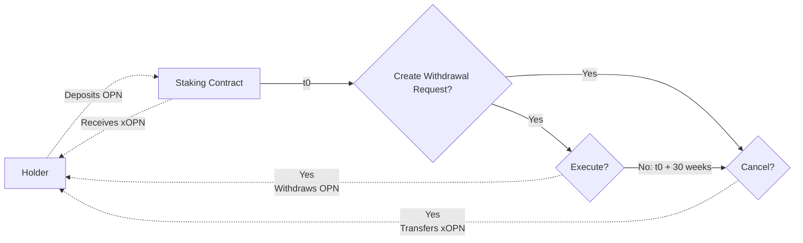

<!-- Source file: ./guides/Token & Economics/a-token-economics-overview.md -->

---
### ⚡️ ==================== ⚡️
---

Title: Overview

Description: The operation of the protocol has been designed to optimise for:

Onchain transparency, value flows, and activity.
Computation and accounting handled via relayer smart contracts.
A clear & simple pricing model.

By structuring a set of System Variables we create a flexible economic system that is fl…

The operation of the protocol has been designed to optimise for:

*   Onchain transparency, value flows, and activity.
*   Computation and accounting handled via relayer smart contracts.
*   A clear & simple pricing model.

By structuring a set of System Variables we create a flexible economic system that is flexible to real world demand and complex pricing scenarios to allow all protocol revenue to exist on-chain.

Supply

----------

The OPN token was migrated previously from OPN which was originally minted during an initial ICO crowdsale in 2017, allocated to a number of partitions (public, user growth fund, stability fund, team, and bounty).

The OPN token has a total and circulating supply of 22,926,928,000 OPN.

Demand

----------

> 📘
>
> ###
>
> OPN Fuels the Ecosystem
>
> OPN is the fuel for each and every ticket processed through the OPEN Ticketing Ecosystem.
>
> The economics of OPN have been designed to ensure that there is on-chain transparency of value flows and activity whilst providing a clear and simple pricing model for ticketing integrators of OPEN.
>
> The amount of OPN required per ticket varies depending on three factors:
>
> *   The price of the ticket.
> *   The products consumed (defining the rate charged).
> *   The price of OPN in USD at the time of top up.
>
> All accounting on-chain is managed in USD to protect integrators against volatility of OPN. This means that the amount of OPN needed is reflexive to it's USD price; when prices are low then more will be required, and when prices are high less will be needed. Upon each top-up the price of OPN is fixed per-integrator account so that a reduction in price does not result in lower than expected service-paid.
>
> *   Token Homepage

Glossary

------------

Before getting started, there are a number of concepts worth orienting on as these will continue to be referenced throughout the documentation. These will be covered in more depth in upcoming sections.

| Term | Meaning |
| --- | --- |
| Interactions | Any event or change of on an NFT ticket, modifying its history or properties. E.g. 'sold', 'resold', 'scanned' |
| Integrator | A user of the protocol. Other than their config the protocol makes no distinction between users, Whether an existing ticketing company, or a partner using of our white-label product, both are integrators. |
| Relayer | The address assigned to an integrator to propagate transactions to the network. Always unique to each integrator but managed by the Ticket Engine API. |
| Available Fuel | The pre-funded OPN balance used by an integrator to fund blockchain interations. OPN is topped up through the Integrator Dashboard. |
| Reserved Fuel | Deducted from available fuel at the time of minting a ticket. This holds a reserved balance within the system until the ticket is checked-in or invalidated. |
| Spent Fuel | The fuel ready to be sent to the collection addresses. This is funded using the reserved fuel when a ticket completes its lifecycle. Can be collected using `FuelDistributor.collect()` |
| Spent Fuel Destinations | The assigned destination addresses that the spent fuel can be distributed to. |


<!-- Source file: ./guides/Token & Economics/b-token-economics-contracts.md -->

---
### ⚡️ ==================== ⚡️
---

Title: OPN Ticketing Contracts

Description: Token Addresses - Polygon
The token addresses of OPN across each chain are:
OPN Contract Address Sophon - 0xA96aD8EC6A83F23e0A75E5d8c9cE13C1042c4295
OPN Contract Address Ethereum - 0xc28eb2250d1AE32c7E74CFb6d6b86afC9BEb6509
OPN Contract Address Solana - J1YnyKzmxBwFkPftvZexnHTm4Am7JnmWydhxtXdwEmMv
O…

Token Addresses - Polygon

-----------------------------

The token addresses of OPN across each chain are:

OPN Contract Address Sophon - 0xA96aD8EC6A83F23e0A75E5d8c9cE13C1042c4295

OPN Contract Address Ethereum - 0xc28eb2250d1AE32c7E74CFb6d6b86afC9BEb6509

OPN Contract Address Solana - J1YnyKzmxBwFkPftvZexnHTm4Am7JnmWydhxtXdwEmMv

OPN Contract Address Polygon - 0x7844F79FC841E4F92d974C417031c76F8578c2D5

OPN Contract Address Base - 0x9A6d24c02eC35ad970287eE8296D4D6552a31DbE

Ticketing Addresses - Polygon

---------------------------------

At the moment we are in the process of moving all our ticketing volume to the Sophon blockchain.

###

Polygon: Economics

*   Polygon: 0xe93EF19446c4e80207add5fA2CD3E0116e8959F4

Responsible for managing the internal balances and accounting within the protocol. Manages available and reserved fuel balances for each integrator as well as the protocol-wide spent fuel balances. The billing rates for each integrator is held within the `integratorRates` mapping and each integrator's metadata can be found within `integratorData`.

Since each integrator can have one or more relayers, Economics.sol also tracks a mapping of `relayerAddress` to the integrator allowing accounting operations to happen only using the relayer address.

###

Auth

*   Sophon: Coming soon!
*   Polygon: 0x821bacd7AAC670Ab7d80bCf74e517620D1a24700

Handles access control and permissions for protected methods used within the protocol such as updating the price oracle, creating integrators, and performing custodial top-ups. Also permissions contracts to each-other so that only certain contracts can talk to protected methods.

###

EventFactory

*   Sophon: Coming soon!
*   Polygon: 0xAC1ffEEA39e3db60599BdF6697988Aa5f0eD26F4

EventFactory.sol is responsible for creating new events and assigning them an index in which they can be referenced using. Because each event is its own independent smart contract, the EventFactory is only responsible for creating each event and setting the initial event metadata. Future updates to metadata must be made directly to the event's contract address.

###

EventImplementation

*   Sophon: Coming soon!
*   Polygon: 0x79fB70D8e1aDe9608F7F7F7ba62821f8CA9f4E08

Never accessed directly, this is the implementation contract used for each event using the BeaconProxy pattern. Each event is a separate contract but uses the same implementation for consistency, and this is the implementation. Contains all of the lifecycle methods for ticket interaction and the ERC-721 implementation. Implements the OpenZeppelin's IERC721 and IERC721Metadata, but not IERC721Enumerable.

###

FuelCollector

*   Sophon: Coming soon!
*   Polygon: 0x56eBD904aa2Cc5696F9Cb05Fa2d2587dB501A8F3

Defines and distributes the collected spent fuel from the Economics contract. Economics is only responsible for tracking the total amount of protocol-spent-fuel and total-spent-fuel but not for the distribution. Exposes a public `collect()` function that can be used to distribute the protocol-spent-fuel to the assigned destination addresses, and then the remainder to the remainder addresses.

###

PriceOracle

*   Polygon: 0xBF705239C90211bff2E4CF513c01209CdA228aF9

Used as an on-chain oracle for the price of OPN in USD to 18 decimal places. This is necessary for valuing direct non-custodial OPN top-ups and is driven using an off-chain worker.

###

Registry

*   Sophon: Coming soon!
*   Polygon: 0x27B50CA961480B35005d452E288600f6e4534eC6

Tracks all of the other contract addresses in use by the protocol. This allows each contract to hold only a reference to the deployed Registry.sol contract and then use this to reference any other contract as needed at runtime. If in doubt, check the registry for the currently active addresses for all other contracts listed here.

###

TopUp

*   Sophon: Coming soon!
*   Polygon: 0x748df336E5d1c6387E3FAD5dEC86FB9B1d4c3Eda

Entrypoint for topping up an integrator account. Contains one public method for non-custodial top-ups using OPN held within the sender's wallet and one protected method for topping-up the available fuel using USDC via a swap using the Sushi pools. Routes transfers via a path of `[baseToken, weth, Economics.fuelToken()]`.

Relayers

------------

A relayer is responsible for minting the NFTs for an integrator and is linked to an integrator's account in order to track OPN fuel balances and accounting per-relayer-address. These relayer addresses have indepenedent rate configurations depending on the products used. _Seeintegrators for more._

A relayer _belongs-to_ an integrator and this means that an integrator can have more than one relayer as necessary should multiple be needed to additional scale, although at present each integrator only has a single active relayer.

You can query for the active relayer addresses using the subgraph:

GraphQL

```
{
relayers {
id
isEnabled
integrator {
name
}
}
}
```


<!-- Source file: ./guides/Token & Economics/c-token-economics-ticket-issuers.md -->

---
### ⚡️ ==================== ⚡️
---

Title: Integrator Accounts

Description: All integrators issuing tickets through OPEN interact with the same contracts, but aren't equal in terms of resource usage and value. Despite all tickets being issued as NFTs on-chain, the path to get there can be different depending on how much of the protocol is required.
OPEN provides a full tick…

All integrators issuing tickets through OPEN interact with the same contracts, but aren't equal in terms of resource usage and value. Despite all tickets being issued as NFTs on-chain, the path to get there can be different depending on how much of the protocol is required.

OPEN provides a full ticketing infrastructure stack that organisers, builders and community members can tap into. This includes:

*   An API for ticket issuances & behind the scenes wallet creation
*   A front-end Wallet UI for accessing onchain tickets and collectibles
*   An event financing hub for raising funds pre-event
*   A global ticketing explorer for viewing real-time ticketing activity around the world
*   A subgraph where anyone can poll and fetch ticketing data
*   A full suite ticketing infrastructure with event dashboard, mobile ticket app & scanner app

See Ticket Engine for guidance on API usage.

Revenue for all product tiers is represented on-chain, but the rates charged depend on the amount of infrastructure used as these have different pricing due to their complexity.

Integrator Billing

----------------------

While it makes sense to treat integrators of each product separately when it comes to pricing based on resource usage, in the eyes of the smart contracts all users are the same (only with different parameters and rate configurations). For that reason we identify all integrators on the protocol by their `relayerAddress` or `integratorIndex`. This allows us to rely on the on-chain identity using the public address of each relayer representing an integrator, regardless of their type or pricing model.

The following rates can be set:

Solidity

```
struct DynamicRates {
uint24 minFeePrimary;
uint24 maxFeePrimary;
uint24 primaryRate;
uint24 minFeeSecondary;
uint24 maxFeeSecondary;
uint24 secondaryRate;
uint24 salesTaxRate;
}
```

Here, it is useful to consider integrators as their data model on-chain as it makes it clear we are discussing smart contracts rather than invoicing or spreadsheet accounting to a business entity.

Usage metering and charging happens in real-time and the account to be charged is determined by the relayer address that is calling the contract and with a blockchain we cannot send an invoice after-the-fact.

Top-Ups

-----------

Each ticket created on the protocol requires OPN to be paid as fuel in order for the NFT to be minted and without this OPN fuel the NFT minting process will fail. Because of that integrators are required to top-up their balances in advance. This top-up process is managed using the Integrator Dashboard and allows for top-up of the account balance directly using OPN held within a cryptocurrency wallet or using bank transfer.

The OPN token itself is volatile and it would be an issue if a top-up would be made that would then reduce in value because of market volatility, so for that reason the value of a top-up is fixed in USD at the time of top up. If a top-up is worth $1,000 at the moment this top-up occurs then the value on-account added to the integrator will be fixed at $1,000 regardless of the price of OPN.

Sales Tax

-------------

'Stichting GET Protocol Foundation' is registered and regulated in the Netherlands and we are required to charge a 21% sales tax (VAT) rate for customers also within the Netherlands. Deductions will be listed on all invoices.

Rate Configuration

----------------------

Each integrator has an independent configuration of variables that define the usage costs of the protocol. OPN is used as the medium of exchange and payment for all interactions on the protocol, but USD is used as the base currency for determining the amount of OPN required.

| Ticket Issuer | Product | relayerAddress | interactionRateConfiguration |
| --- | --- | --- | --- |
| Duff Stadium | Full Suite | e.g. 0x36...fBBB3D | {primaryRateWL, secondaryRateWL, ...} |
| Globex Corporation | Ticket Issuance API | e.g. 0x4eF...8d148 | {primaryRateWL, secondaryRateWL, ...} |
| Moe's Tavern | Ticket Issuance API | e.g. 0xA0b8...eB48 | {primaryRateDT, secondaryRateDT, ...} |

A list and description of the rates used in each `DynamicRates` configuration can be found in System Variables.

> 📘
>
> ###
>
> Remember
>
> Although all NFTs are created with the same code, the rate configuration set for each integrator will depend on the product package used.


<!-- Source file: ./guides/Token & Economics/d-token-economics-interactions.md -->

---
### ⚡️ ==================== ⚡️
---

Title: Interactions & Dynamic Pricing

Description: Usage pricing of the protocol 'depends on' three main factors; the price of the ticket, who is issuing the ticket, and what action is required.

Price, represented as basePrice on-chain as USD.
Who, the integrator containing the rate for the interaction e.g. primaryRate.
What, the interaction being …

Usage pricing of the protocol 'depends on' three main factors; the price of the ticket, who is issuing the ticket, and what action is required.

*   _Price_, represented as `basePrice` on-chain as USD.
*   _Who_, the integrator containing the rate for the interaction e.g. `primaryRate`.
*   _What_, the interaction being requested e.g. `sold`, `scanned`.

The amount of OPN needed as fuel for a given interaction is calculated from the USD denominated `basePrice` of each ticket and the fixed latest price of top-up of an integrator. These prices are always referred to in US dollar terms even if the ticket itself is sold/traded in a different currency and is done to standardise the on-chain accounting to a single currency.

Defining Interactions

-------------------------

At its core an interaction is _change of state_ of the NFT on-chain. This could take the form of minting the NFT to changing the metadata and status of the ticket. We make a distinction between two main classes of interactions; basic interactions and premium interactions. Both types are fuelled using OPN but use different fuel accounting mechanisms.

*   **A basic interaction** is one that is paid for by OPEN assigned at the time of mint. This OPN is added to the 'fuel tank' of the NFT and subsequent interactions will continue to get charged from this fuel tank balance. How much OPN needed for minting is determined by the `primaryRate` (a percentage of the `basePrice`).
*   **A premium interaction** is an additional charge of OPN that will vary by the interaction that is being called, the integrator holding the configuration, and the `basePrice` of the ticket.

All NFTs require a `primaryRate` to be paid at the point of minting the NFT. Premium interactions are always optional and are additional to the base operations for an NFT lifecycle. All basic interactions will be funded from the OPN allocated when minting, premium interactions will require additional OPN to fund.

###

Basic Interactions

Because the OPN needed to fund all basic interactions for a ticket is allocated up-front (when minting) it means that all basic interactions performed on that ticket after mint will not require additional OPN to fund. This is important because it allows cost-predictability that covers the full standard lifecycle of a ticket. In other words the OPN required to complete the rest of the lifecycle has already been reserved.

The Primary Sale (Sold) interaction is required to mint a ticket and deducted from Available Fuel.

The current basic interactions are:

*   Scanned
*   Checked-In
*   Invalidated
*   Claimed

###

Premium Interactions

An premium interaction requires additional OPN to be paid atomically within the transaction. These interactions are not funded from the fuel reserved at the time of mint. This is a hard requirement for the interaction to complete and the state change to be successful so attempting to perform these interactions without available balance will fail.

The current premium interactions are:

*   Secondary Sale (Resold)
_\*Note that Secondary Sale is not billed for API customers and will be optionally enabled alongside ourImmutable X decentralised secondary marketplace product._

> 👍
>
> ###
>
> Recap
>
> *    Pricing is relative to the USD basePrice of a ticket and the fixed price of an integrators top-up.
> *    There are two main classes of interaction; basic and premium.
> *    The `primaryRate` is charged once when the ticket is minted covers all basic interactions.
> *    Premium rates accumulate. An ticket resold 4 times will incur 4 charges by its `secondaryRate`.


<!-- Source file: ./guides/Token & Economics/e-token-economics-fuel.md -->

---
### ⚡️ ==================== ⚡️
---

# Fuel
So far we've covered the main interaction types and how they are priced, but where are the balances stored? And how are they accounted for?

This section will go into depth on the different addresses and balance in use within the system so may be overwhelming to casual readers. Treat this as reference documentation for the on-chain ecominics, but not all of this info needs to be absorbed in detail.




The Fuel Flow of OPN

The OPN flow through the system can be summarised as follows:

1.  An integrator tops up their **1️⃣ Available Fuel** using the Integrator Dashboard.
2.  Upon minting a ticket OPN is reserved from the Available Fuel into the **2️⃣ Reserved Fuel** as determined by the primaryRate.
3.  When a ticket is checked-in this OPN is moved to the **3️⃣ Spent Fuel** balance ready for collection.
4.  The FuelDistributor contract can be used to issue a OPN token transfer from the Spent Fuel to the **4️⃣ Fuel Destination** addresses.

Each of the two main interaction types (Basic & Premium) source their fuel from different balances. Basic interactions are always sourced from the _Reserved Fuel_ as a percentage of the reserved fuel per-active-ticket, and premium interactions are paid for by the integrator's _Available Fuel_ balance.

When NFT tickets are first minted they allocate a certain balance of OPN into the _Reserved Fuel_ and is no longer usable for further minting, only for future basic interactions. This OPN 'lives within the system' until the ticket lifecycle is completed. Premium interactions are funded directly from the _Available Fuel_.

Let's break it down.

*   The OPN token acts as the programmable fuel for platform.
*   Each interaction is priced as a rate of the ticket's price or as a fixed USD fee.
*   Each integrator has their own available account balance, which can be topped-up using the dashboard.
*   Top-ups are valued and fixed in USD to protect against OPN token volatility.
*   When an NFT is minted, OPN is deducted from the integrator's _Available Fuel_ into the _Reserved Fuel_ to cover the basic ticket lifecycle.
*   Further premium interactions would be funded from the integrator's _Available Fuel_.

Only when the ticket has completed it's lifecycle (either invalidated or checked-In) will the fuel be 'spent' and ready to be collected.

> 📘
>
> Integrators do not need to be aware of the following implementation detail as this is abstracted away from usage. Each integrator's account contains an internal 'OPN price' that is used to calculate the amount of OPN needed on each interaction. This section acts as a reference on how this is calculated from first principles.

In a standard basic lifecycle of a ticket, the most important variable used is the `primaryRate` which defines the cost of minting an NFT as a percentage of the ticket's `basePrice`. We can use both the rate and price to calculate the expected USD cost of minting an NFT.


```
cost = basePrice * primaryRate
```


The `basePrice` is provided at the time of mint and the `primaryRate` is set at the time of creating an integrator so this can all be processed on-chain.

As this cost is denominated in USD, we also need to have a price of OPN available to compute the amount of OPN needed for the interaction. This already held per-integrator and determined by the price at the time of top-up.

With this OPN amount calculated it is then possible to check the _Available Fuel_ balance to ensure that is is greater than the amount to be deducted. If yes then this will be deducted from the _Available Fuel_ and added to the _Reserved Fuel_.

Because of this real-time deduction the protocol can be thought of as being paid for _on debit_.

Check-in and invalidate interactions are one-way operations and will finalise the state of the ticket, making it claimable as an NFT collectible, ending its basic interaction lifecycle. If billed, claims and further interactions with this ticket will be funded by the integrator as premium interactions.

Due to gas constraints it is not economical to transfer OPN on-chain for every ticket check-in and as such after checking-in a ticket the OPN is added to the _Spent Fuel_ balance prior to being collected. As soon as the _Spent Fuel_ balance is allocated this can be collected using the public `FuelDistributor.collect()` function that will initiate a transfer to the desintation addresses as defined by their percentages.

To allow the on-chain economics to independently meter revenue between the base protocol costs and value-adding product fees the spent and reserved fuel balances have been split into two; total fuel, and protocol fuel. To use spent fuel as an example:

*   `spentFuel` is the complete amount of OPN fuel used and awaiting collection.
*   `spentFuelProtocol` is the amount of fuel charged only for basic protocol fees, in this case Digitial Twin.

The white-label product is a superset of the digital twin and includes many value-adding event management features not present in the digital twin product. But each white-label ticket still requires an NFT and to properly allocated revenue between these products the 'protocol fuel' is tracked alongside the total fuel usage.

Digital twin usage is set as a fixed-fee per-NFT charge and is deducted before any other white-label revenue costs meaning the protocol takes the first slice of the overall fuel usage per-transaction.

Both the OPN Ticketing Ecosystem and OPN Foundation require independent revenue streams, fee collection, and treasury management as each have different strength and weaknesses. At present, all product development is funded by OPN Foundation and as a result requires fuel revenue to sustainably continue operations. The DAO will continue to scale up over time and onboard operational costs and expenses and as a result the fuel revenue allocation to the DAO will also grow.

There is a simple product-organisation relationship available:

*   Revenue from API issuances will be accrued as _protocol fuel_ and sent to the Ticketing Revolution DAO.
*   Revenue from the full suite will be accrued as the _remaining fuel_ and sent to OPN Foundation.

This matches the ethos of each product; decentralised blockchain products will be the responsibility of the DAO, centralised ticketing-system products will be the responsibility of the Foundation.

Although the DAO does not yet fund operational costs and product development of the Digital Twin, this opens up a migration path to increase this responsibility when the has DAO reached maturity. Until this point the DAO will capture Digital Twin revenue with the expectation that it will eventually manage product development costs.



The destination addresses (recipients) of the spent fuel are defined depending on the source of the spent fuel; protocol or remainder. This gives flexibility and autonomy to each organisation in how they wish the fuel revenue to be split. Any number of addresses can be defined along with the percentage of the spend fuel portion that will be sent to that recipient.

For example, if the protocol spent fuel amount is 1000 OPN and the DAO main address is set to collect 80% of this fuel and the bounty program is allocated 20%, then the DAO main address will receive 800 OPN and 200 OPN will be sent to the bounty program address.

The [subgraph](https://thegraph.com/hosted-service/subgraph/getprotocol/get-protocol-subgraph) can be used to list the current recipients:

```
{
  spentFuelRecipients {
    id
    source
    label
    percentage
  }
}
```


> 📘
>
> *   Safety. As soon as fuel is allocated to the spent fuel balance it would be collectable to the destination addresses making it unrecoverable by the economics contract. Keeping this as a reserved balance protects against edge-cases that might require recovery of this fuel.
> *   The ticket has not completed its lifecycle. It's important that stakeholders are incentivised to encourage proper use of the protocol, rather than focusing only on the initial mint.

To ensure that there is a constant flow of funds from _Reserved Fuel_ to _Spent Fuel_, basic actions will be taxed a percentage of what was reserved on primary sale and this is set to 20%. If a ticket required 1.5 OPN to be used as fuel on primary mint and then this is scanned, 0.3 OPN will be deducted from the reserved fuel balance and added to the spent fuel balance.

Doing this prevents tickets with a longer lifecycle or multiple scan interactions from becoming stale and provides a steady stream of spent fuel prior to being checked-in.

_Bear in mind that the examples here are just that, examples. The primaryRate used will depend on the products used by the integrator and the fee that can be charged as a result. See the[Integrator Accounts](doc:token-economics-ticket-issuers) section for more._

```
flowchart LR
  %% Ticket Issuance
  subgraph TicketIssuance["Ticket Issuance"]
    Integrator["Integrator"]
    Integrator --> ActionSold["Action: Sold"]
    ActionSold --> NFTTicket["NFT Ticket"]
    NFTTicket --> PrimarySalePrice["Primary Sale Price"]
  end

  PrimarySalePrice --> FuelCalc["Fuel Calculation"]

  %% Fuel Accounting
  subgraph FuelAccounting["Fuel Accounting"]

    subgraph Econ1["Economics.sol"]
      FuelCalc -->|1.5 GET| AvailableFuel1["Available Fuel\n1.5 GET"]
      FuelCalc -->|1.5 GET| ReservedFuel1["Reserved Fuel\n1.5 GET"]
    end

    subgraph Econ2["Economics.sol"]
      ActionResold["Action: Resold"]
      ActionResold -->|−1.5 GET| AvailableFuel2["Available Fuel\n0 GET"]
      ActionResold -->|+1.5 GET| ReservedFuel2["Reserved Fuel\n3 GET"]
    end

    subgraph Econ3["Economics.sol"]
      ActionScanned["Action: Scanned"]
      ActionScanned -->|−0.6 GET| ReservedFuel3["Reserved Fuel\n2.4 GET"]
      ActionScanned -->|+0.6 GET| SpentFuel1["Spent Fuel\n0.6 GET"]
    end

    subgraph Econ4["Economics.sol"]
      ActionCheckedIn["Action: Checked-In"]
      ActionCheckedIn -->|−2.4 GET| ReservedFuel4["Reserved Fuel\n0 GET"]
      ActionCheckedIn -->|+2.4 GET| SpentFuel2["Spent Fuel\n3 GET"]
    end

  end
```

An example fuel balance transition as a ticket moves through its lifecycle.


| Step | Interaction | Cost | From Account | Sent To |
| --- | --- | --- | --- | --- |
| 1 | sold (basic) | (primaryRate x basePrice)/price (3% x $50)/$1 = **1.5 OPN** | Available Fuel **\-1.5 OPN** | Reserved Fuel **+1.5 OPN** |
| 2 | resold (premium) | (secondaryRate x basePrice)/price (3% x $50)/$1 = **1.5 OPN** | Available Fuel **\-1.5 OPN** | Reserved Fuel **+1.5 OPN** |
| 3 | scanned (basic) | 3 OPN x 20% = **0.6 OPN** | Reserved Fuel **\-0.6 OPN** | Spent Fuel **+0.6 OPN** |
| 4 | checkedIn (basic) | Remaining **2.4 OPN** | Reserved Fuel **\-2.4 OPN** | Spent Fuel **+2.4 OPN** |
| 5 | `undefined collect()` |  | Spent Fuel **\-3 OPN** | Collected Fuel **+3 OPN** |
| **TOTALS** |  |  | Available Fuel **\-3 OPN** | Collected Fuel **+3 OPN** |

> 👍
>
> *   There are three balances of OPN within the system; _Available Fuel_, _Reserved Fuel_, and _Spent Fuel_.
> *   When minting a ticket, the cost is moved from _Available Fuel_ to _Reserved Fuel_.
> *   This _Reserved Fuel_ funds the basic lifecycle. Premium interactions are funded by the _Available Fuel_.
> *   When a ticket is finalised the remaining _Reserved Fuel_ will be moved to _Spent Fuel_.
> *   The _Spent Fuel_ can be sent to the destinations using the public `collect()` function.

<!-- Source file: ./guides/Token & Economics/f-token-economics-staking.md -->

---
### ⚡️ ==================== ⚡️
---

Title: Staking

Description: The OPN Ticketing Ecosystem staking system has been designed to align incentives of ecosystem participants, providing a governance-compatible token lockup mechanism while offering rewards on deposits. Depositing your OPN into the staking vault acts as a commitment to the long-term vision of the prot…

The OPN Ticketing Ecosystem staking system has been designed to align incentives of ecosystem participants, providing a governance-compatible token lockup mechanism while offering rewards on deposits. Depositing your OPN into the staking vault acts as a commitment to the long-term vision of the protocol and is rewarded with governance rights and staking rewards.

This system has been designed to a number of principals:

*   **Composability.** The smart contract implements the ERC-4626 Tokenized Vault Standard and issues an ERC-20 share token (xOPN) representing vault deposits and accrued rewards.
*   **Rewards.** The staking vault is able to act as the primary destination for revenue-driven rewards across multiple products and future revenue streams.
*   **Governance.** A lockup mechanism ensures that governance votes are driven by long-term participants in the OPN Protocol ecosystem.
*   **Flexibility.** Instant withdrawals are available subject to a percentage fee set by the DAO. This fee is distributed amongst remaining depositors.

xOPN

--------

The xOPN share token is issued to track individual OPN balances held within the staking vault and is transferrable. Upon depositing _OPN_ into the vault you will be returned with an amount of _xOPN_ that represents your underlying assets at the time of deposit. The OPN deposited will remain in the vault until withdrawal.

*   Upon deposit OPN is transferred to the staking vault and xOPN is minted to the depositor.
*   Upon withdrawal xOPN is burned and OPN is returned to the depositor.

Once deposited, this OPN will be owned by the vault until withdrawal and cannot be transferred or traded.

Rewards

-----------

> 📘
>
> All rewards provided from protocol revenue are not guaranteed and may be halted at any time.

xOPN follows the xToken model and can only accrue value against the underlying asset, in this case OPN. This is known as a yield-bearing asset.

Or in more plain terms; xOPN will always be redeemable for the same amount or more OPN than deposited, never less, because xOPN would be equal to `assetsDeposited + assetsRewarded`. Therefore xOPN is a share token that represents the underlying assets in the vault where there are only two ways for OPN to enter; deposited by a staker, or transferred to the vault as rewards.

###

Reward Period

A linear reward issuance mechanism is applied to prevent depositors attempting to enter at favourable times when large rewards are deposited into the contract and gaining an unfair advantage. The linear release mechanism releases rewards on every block to smooth this distribution across a time period, for xOPN this is set to 2 weeks.

###

Reward Sources

The staking system currently aggregates four sources of rewards that are regularly distributed:

*   A percentage of **Ticketing Fees** from fuel usage is redeemable as staking rewards upon each ticket check-in or invalidation. This can create streaming rewards to stakers driven by real-world ticketing usage. 100% of UGF funded top-ups will go to stakers.
*   A percentage of **Trading Fees** collected by protocol-owned-liquidity will be available as staking rewards. The OPN collected fees will be transferred to the staking contract and the ETH/USDC collected fees will compound the position.
*   **Instant Withdrawal Fees** are triggered when a staker withdraws their assets prior to the unlock time. This fee will remain on the contract and be distributed to remaining stakers.
*   When a staker wishes to withdraw via a standard withdrawal their shares will be locked within the vault. The staker does not earn rewards during this withdrawal period but the underlying shares still accrue this value, which is then redistributed to remaining stakers upon cancellation or withdrawal execution. These are known as **Redistributed Rewards**.

Lockup & Withdrawals

------------------------

> ⚠️
>
> ###
>
> All tokens deposited into the vault are subject to time-based or fee-based withdrawal conditions.

Once tokens have been deposited into the staking vault they are subject to one of the following withdrawal conditions:

*   A **standard withdrawal** can be initiated for the current redeemable assets within the vault subject to a maturity period prior to execution (currently 6 months). No fee is applied to the underlying assets after maturity, but can be paid for early execution.
*   An **instant withdrawal** can be executed subject to a percentage fee distributed among remaining depositors within the vault.

This has been designed to ensure that xOPN will be compatible with governance participants who are able to demonstrate commitment to a longer-term position in the protocol.

###

Standard Withdrawals

Standard withdrawals are a two step process:

1.  A withdrawal request must first be created, freezing the exchange rate for later execution and reserve xOPN.
2.  After 26 weeks this withdrawal request will reach maturity and will be able to be executed. This must be acted upon within 4 weeks.
3.  If executed prior to the 26 week maturity period then a percentage fee must be paid as a percentage of the time elapsed. If the instant withdrawal fee is 15% and the withdrawal request has been open for 13 weeks, then a 7.5% fee must be paid for execution.



Creating a withdrawal request reserves this balance for withdrawal and the _shares (xOPN)_ required for the withdrawal are transferred to the staking contract and held there until cancellation or execution. Multiple withdrawal requests can be created, executed, and cancelled independently.

A withdrawal request can be cancelled at any time, returning the _assets (OPN)_ back to the staker's balance at the current rate. Note that when a withdrawal request is created, this will stop accruing rewards and no longer have governance rights, therefore cancelling a withdrawal request will return fewer _shares (xOPN)_ than initially created with.

Cancellations can be made any time after withdrawal request cration, the rewards earned by the _shares (xOPN)_ held on the staking contract will be redistributed to all stakers.

> 👍
>
> ###
>
> Recap
>
> *   A standard withdrawal is a two step process beginning with creation of a withdrawal request. This locks the current rate of exchange for later execution & transfers xOPN to the staking contract.
> *   After 26 weeks there will be the option to execute this withdrawal at the fixed rate and will be available for execution for 4 weeks, after which it can only be cancelled. Execution can happen within this time for a fee.
> *   Cancellations return the reserved OPN as xOPN at the rate at the time of cancellation.
> *   OPN reserved within a withdrawal request does not earn rewards or have governance voting rights.

###

Instant Withdrawals

Instant withdrawals are available without a wait period and can be executed in a single transaction.

To execute an instant withdrawal a fee must be paid on the returned assets, which is then shared with the remaining stakers in the vault, boosting their rewards. xOPN within a stakers wallet can be instantly withdrawn at any time.

If the staker wishes to withdraw the reserved balance in an existing standard withdrawal request then this request must first be cancelled prior to instant withdrawal.

The percentage fee paid is defined by the `instantWithdrawalFee` variable and is current set at 15%. Should a staker wish to instantly withdraw 1000 OPN then 150 OPN would remain on the staking contract.

> 👍
>
> ###
>
> Recap
>
> *   Instant withdrawals are available at any time and are subject to a percentage fee.
> *   This percentage fee is shared across all remaining stakers in the vault and boost rewards.
> *   A standard withdrawal request must first be cancelled before it can be instantly withdrawn.

Governance

--------------

To ensure that governance voting power is fairly distributed across all chains, voting power is determined by the amount of _assets (OPN)_ held within the staking contract rather than the _shares (xOPN)_ held within your wallet. Rewards count towards voting power and are available as soon as they are distributed.

The staking contract implements the Compound governance standard as defined within OpenZeppelin's ERC20Votes.sol, supporting vote delegations and snapshots.

As per the OpenZeppelin standard voting power is not automatically given upon deposit and must be activated individual using a call to the `delegate` function, passing their own address. This makes transfers cheaper as voting is not required to be redelagated upon each transfer.

Example

-----------

As rewards are accrued, xOPN will increase in price relative to OPN since it will be redeemable for the amount of OPN deposited plus the rewards earned.

For example:

1.  A depositor wishes to enter the vault when xOPN is worth 1.1 OPN. It can be assumed that there have been 100 OPN deposited and 10 OPN rewarded with 100 xOPN shares issued. This results in 100 xOPN outstanding with 110 OPN underlying for a rate of 1.1 OPN/xOPN.
2.  This depositor deposits 55 OPN at the rate of 1.1 OPN/xOPN. This issues 50 xOPN to the depositor and increases the underlying OPN in the vault to 165 OPN.
3.  An additional 3 OPN rewards are transferred to the vault contract increasing the underlying OPN from 165 OPN to 168 OPN with 150 xOPN outstanding.
4.  The new OPN/xOPN rate will have increased from 1.1 to 1.12 and a withdrawal request will be eligible to be created for a maximum of 50 xOPN shares returning 56 OPN for execution after 26 weeks.

The vault contract can only accept deposits or accrue rewards shared across all depositors based on their shares of the vault and therefore the OPN/xOPN rate can only increase.

Dashboard

-------------

> 👍
>
> ###
>
> Always ensure that you're browsing the correct URL: https://token.onopen.xyz

The token dashboard's staking page is the easiest way to deposit and withdraw your OPN into the staking contracts. This front-end application will track rewards and historical deposits and withdrawals using a variety of browser-connected wallets.

###

Depositing your OPN

A first time deposit is a two step process and handled using the deposit tab on the 'Stake' page. Firstly a one-time approval for OPN will need to be made to the staking contracts, which allows a deposit to take place.

Secondly a deposit for the amount you wish to stake must be made. Prior to depositing a confirmation step will take place listing the deposit and withdrawal conditions. Ensure you understand this before proceeding with the deposit.


###

Withdrawing your OPN

There are two withdrawal methods available to receive your OPN; standard withdrawals and instant withdrawals. Standard withdrawals are subject to a withdrawal period and operate in a two step flow where a withdrawal request is first created and then must be executed at a later date. This is the default flow and will be triggered using the 'Create withdrawal request' button after entering your withdrawal amount.

Should you wish to have instant access to your OPN then the 'Immediately execute this withdrawal.' toggle must be selected before using the 'Withdraw instantly' button. In both cases you will be given a confirmation step with the conditions of the withdrawal.

###

Bridging your xOPN

It is possible to move your xOPN between the Polygon and Ethereum networks by navigating to the 'Bridge' page. This works by temporarily withdrawing the underlying staked OPN before bridging this via the native Polygon PoS bridge and then restaking it on the destination network. Since the OPN needs to be restaked after bridging this requires two transactions:

1.  First the stake is bridged from your chosen source network to the destination network.
2.  After a period of time (e.g. 1 hour) then this OPN is available for re-staking on the destination.

Due to differences in xOPN/OPN rates between networks you will receive a different amount of xOPN before and after the bridging process. Crucially however, the OPN staked will be identical and therefore the value of your stake will also be the same. Withdrawal requests are not able to be bridged and must be first cancelled before bridging.

Contracts

-------------

> ⚠️
>
> ###
>
> All smart contracts will be audited by a third party and reasonable steps will be taken to reduce smart contract risk. Loss due to smart contract risk cannot be compensated by OPN Protocol.

OPN is available on both Polygon and Ethereum and as such the staking contracts will be launched on both networks. Due to small differences in rewards the rate of xOPN may not be equivalent on each network and cannot be bridged.

*   **Polygon**: 0x3e49E9C890Cd5B015A18ed76E7A4093f569f1A04
*   **Ethereum**: 0x3e49E9C890Cd5B015A18ed76E7A4093f569f1A04

The vault contract is immutable and cannot be upgraded. The following operational parameters are able to be modified through governance votes:

*   `instantWithdrawalFee` to set the percentage fee paid for instant withdrawals from the vault, _default: 15._
*   `lockTime` defines the the length of time before a standard withdrawal request becomes executable, _default: 26 weeks._
*   `withdrawalFeeExemptions` to be used to allow other contracts to execute withdrawals without being subject to the instant withdrawal fee, e.g. token migration contracts.

Two protected functions can be called only by the owner:

*   `setPendingOwner()` can be called by the current owner to transfer ownership to a new owner address.
*   `updateVestingSchedule(uint256 vestingPeriod_)` is an owner-protected function that can be used to set a custom-length vesting period.

Historical data has been made available through a dedicated token subgraph and more information is available in the Developer Tooling page.

Audits

----------

On Oct 26th, 2022 the OPN Protocol DAO voted to fund yAcademy to audit the _GovernanceLockedRevenueDistributionToken_ and _LockedRevenueDistributionToken_ contracts at v1.0.0 via a Snapshot vote. This has now been completed and the audit report is available for viewing using the links below.

| Auditor | Commit | Links |
| --- | --- | --- |
| yAcademy | `ab272ce` | Report, Archive, PDF |


<!-- Source file: ./guides/Token & Economics/g-token-economics-developer-tooling.md -->

---
### ⚡️ ==================== ⚡️
---

Title: Developer Tooling

Description: Ticket Subgraph
The OPN Ticketing Ecosystem Ticket Subgraph is the primary way to view historical data of protocol usage and this indexes the amount of OPN used per-integrator and across the entire protocol. This is based on The Graph Protocol and is quickly becoming the standard for on-chain data a…

Ticket Subgraph

-------------------

The OPN Ticketing Ecosystem Ticket Subgraph is the primary way to view historical data of protocol usage and this indexes the amount of OPN used per-integrator and across the entire protocol. This is based on The Graph Protocol and is quickly becoming the standard for on-chain data aggregation.

*   See the GitHub documentation for more information and up to date examples on query usage.
*   Visit The Graph Explorer to run your own queries.

Token Subgraph

------------------

A separate subgraph is available for aggregating token stats, primarily servicing staking imformation such as deposits, withdrawals, fees, and vesting schedules. Since subgraphs can only listen to a single network there are two subgraphs available, one for Polygon and one for Ethereum. Both subgraphs are initialized from the same code and use the same schema.

*   Visit the explorer for your chosen network to run your own queries:
*   Ethereum Graph Explorer.
*   Polygon Graph Explorer.

Updated about 1 month ago

<!-- Source file: ./guides/Token & Economics/h-token-economics-system-variables.md -->

---
### ⚡️ ==================== ⚡️
---

# System Variables

_The rates listed below are used as a percentage fee to fund a given interaction. These are then charged in OPN to fund an interaction. More may be added as the pricing model evolves into new use-cases._

_See[Integrator Accounts](https://docs.onopen.xyz/docs/token-economics-ticket-issuers) and [Fuel](https://docs.onopen.xyz/docs/token-economics-accounting) for more._

| Name | Description |
| --- | --- |
| `undefined primaryRate` | Percentage rate of the `undefined baseFee` to mint an NFT through the primarySale function. Allocated to reserved fuel upon mint. |
| `undefined secondaryRate` | Charged for white-label customers that use the secondary market feature and defined the percentage of the `undefined baseFee` to deduct. |
| `undefined minFee` & `undefined maxFee` | Fixed minumum and maximum fees for primary and secondary market orders. |
| `undefined taxRate` | Percentage rate of the remaining per-ticket reserved fuel to spend during a basic interaction. |
| `undefined protocolRates` | Rate schedule for protocol fuel allocation, the subset pricing used to determine protocol-level (Digital Twin) pricing. |


<!-- Source file: ./guides/Ticket Explorer/a-ticket-explorer-overview.md -->

---
### ⚡️ ==================== ⚡️
---

Title: Overview

Description: What is the Ticket Explorer?
The Ticket Explorer is an interface to read OPN Ecosystem blockchain ticket information. Because of the transparency and open nature of the blockchain, all tickets from all integrators will be visible within the explorer. It acts as a public gateway to tickets registered…

What is the Ticket Explorer?

--------------------------------

The **Ticket Explorer** is an interface to read OPN Ecosystem blockchain ticket information. Because of the transparency and open nature of the blockchain, all tickets from all integrators will be visible within the explorer. It acts as a public gateway to tickets registered & distributed using the Ticket Engine.

> 👍
>
> ###
>
> Use the Ticket Explorer to:
>
> *    View registered tickets and events on the blockchain.
> *    See the timeline of an individual ticket.
> *    Browse statistics on traffic flowing through the platform.
> *    View the collectible tickets claimed for a blockchain wallet address.
> *    Access the raw blockchain transactions for a ticket.

Transparency in Ticketing

-----------------------------

Browse the Ticket Explorer to see the latest statistics and minted tickets.

Each ticket created on the protocol has a unique ID known as the `nftId` and is compsed of three components; the `chainId`, the `eventIndex`, and the `tokenId`. Put together these act as the global NFT identifier that can be used to find any ticket minted on any chain, for any event. For a the 12th NFT minted for event 6 on the Polygon network would have the ID `POLYGON-6-12`.

> 📘
>
> ###
>
> OPN Ticketing Ecosystem is migrating from Polygon to Sophon. It will take several weeks to migrate the systems of the ticketing companies that have integrated with OPN. All the old events and tickets will remain available on Polygon - but from a certain point all the new tickets and events will be registered/issued on Sophon. Including the OPN Secondary ticket market.

The Ticket Explorer is used to display a timeline of events for that ticket, including the metadata provided when creating an event using the Ticket Engine. Transparency is at the heart of what we offer and the ticket explorer offers a convenient way allow your users to check the validity of their ticket, even just by redirecting them to their ticket using the NFT ID.

Upon recieving a callback with a promise ID to confirm the transaction has been processed, the actions endpoint will return both an `nftId` as well as an `explorerUrl` that can be used to link a user to their ticket on the explorer.

See the history of a ticket on the timeline page using its nftId.

Tickets as Collectibles

---------------------------

After the event cycle (or more accurately as soon as a ticket is scanned), the ticket will be eligible to be claimed. Processing a claim transfers the ticket NFT to an address managed externally to OPN Ecosystem, typically the wallet address of a user that wishes to claim their own ticket as an item of digital memorabilia.

Because this represents true digital ownership the process of claiming is not reversible. It becomes fully owned by the destination address and is free to be tracked and traded on third party marketplaces such as OpenSea.

Updated about 1 month ago

<!-- Source file: ./guides/Ticket Explorer/b-ticket-explorer-environments.md -->

---
### ⚡️ ==================== ⚡️
---

Title: Environments

Description: We offer two environments for integration, a playground (sandbox) and production. These environments are connected to their equivalent Ticket Engine environments and data created in via the API will be visible in the Explorer.
Explorer

Playground: https://playground.explore.onopen.xyz
Production: h…

We offer two environments for integration, a playground (sandbox) and production. These environments are connected to their equivalent Ticket Engine environments and data created in via the API will be visible in the Explorer.

**Explorer**

*   Playground: https://playground.explore.onopen.xyz
*   Production: https://explore.onopen.xyz/

**GraphQL**

The Ticket Explorer is a front-end driven by publicly indexed data using TheGraph and then the Metadata endpoint for fetching NFT content. The GraphQL data sources are publicly available for querying:

*   Playground: https://thegraph.com/hosted-service/subgraph/getprotocol/playground-get-protocol-subgraph
*   Production: https://thegraph.com/hosted-service/subgraph/getprotocol/get-protocol-subgraph

_SeeDeveloper Tooling for more._

Updated about 1 month ago
