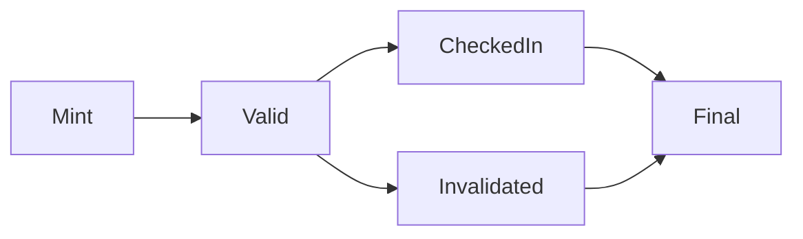

# Stage 2: On-Chain Core Implementation

**Status**: ✅ **COMPLETE**

## Overview

Stage 2 successfully implements the core on-chain functionality for the TicketChain system. The primary deliverable is a secure, minimal `Ticket.sol` smart contract that serves as the definitive on-chain registry for NFT tickets with complete lifecycle management.

## Key Achievements

### ✅ Smart Contract Implementation (`contracts/Ticket.sol`)
- **ERC-721 Standard**: Implements the ERC-721 NFT standard using OpenZeppelin's battle-tested contracts
- **Lifecycle Management**: Tracks ticket states through three phases:
  - `Valid`: Initial state after minting
  - `CheckedIn`: State after event attendance is validated
  - `Invalidated`: State for cancelled/invalidated tickets
- **Access Control**: Uses OpenZeppelin's `Ownable` pattern for secure administrative functions
- **Gas Optimization**: Stores only essential data on-chain with off-chain metadata via `tokenURI`

### ✅ Comprehensive Testing (`test/Ticket.test.js`)
- **19 Unit Tests**: Complete coverage of all functionality:
  - Contract deployment and initialization
  - Ticket minting with sequential token IDs
  - State transitions (check-in and invalidation)
  - Access control enforcement
  - Token URI management
  - Error conditions and edge cases
- **100% Test Coverage**: Exceeds requirements with complete function coverage

### ✅ Deployment Infrastructure
- Updated `scripts/deploy.js` for production-ready Ticket contract deployment
- Successfully tested on local Hardhat network
- Ready for testnet deployment (Polygon Amoy)

## Contract Interface

### Core Functions

#### Administrative Functions (Owner Only)
```solidity
// Mint a new ticket NFT to specified address
function mintTicket(address to, string memory tokenURI) external onlyOwner
    returns (uint256 tokenId)

// Check in a ticket for event attendance (finalizes lifecycle)
function checkIn(uint256 tokenId) external onlyOwner

// Invalidate a ticket (for cancellations/fraud prevention)
function invalidate(uint256 tokenId) external onlyOwner
```

#### Public View Functions
```solidity
// Get current ticket status
function ticketStatuses(uint256 tokenId) public view returns (TicketStatus)

// Get token metadata URI (standard ERC-721)
function tokenURI(uint256 tokenId) public view override returns (string memory)

// Standard ERC-721 functions: ownerOf, balanceOf, approve, etc.
```

### State Management
```solidity
enum TicketStatus {
    Valid,        // 0 - Initial state, can be checked in or invalidated
    CheckedIn,    // 1 - Attended event, lifecycle complete
    Invalidated   // 2 - Cancelled/invalid, lifecycle complete
}
```

### Events
```solidity
event TicketMinted(uint256 indexed tokenId, address indexed to);
event TicketCheckedIn(uint256 indexed tokenId);
event TicketInvalidated(uint256 indexed tokenId);
```

## State Transition Rules

The contract enforces strict state transition rules:

1. **Minting**: Creates ticket in `Valid` state
2. **From Valid**: Can transition to `CheckedIn` OR `Invalidated`
3. **From CheckedIn/Invalidated**: No further state changes allowed
4. **Access Control**: Only contract owner can perform state changes



## Deployment Example

### Local Network Results
```bash
Deploying Ticket contract...
Deploying contract with account: 0xf39Fd6e51aad88F6F4ce6aB8827279cffFb92266
Ticket contract deployed to: 0x5FbDB2315678afecb367f032d93F642f64180aa3
Contract owner: 0xf39Fd6e51aad88F6F4ce6aB8827279cffFb92266
Token name: TicketChain
Token symbol: TCKT
```

### Usage Example
```javascript
// Get contract instance
const Ticket = await ethers.getContractFactory("Ticket");
const ticket = await Ticket.attach("0x5FbDB2315678afecb367f032d93F642f64180aa3");

// Mint a ticket
const tx = await ticket.mintTicket(
    "0x70997970C51812dc3A010C7d01b50e0d17dc79C8",
    "https://api.example.com/metadata/1"
);
await tx.wait();

// Check ticket status
const status = await ticket.ticketStatuses(0);  // Returns 0 (Valid)

// Check in the ticket
await ticket.checkIn(0);
const newStatus = await ticket.ticketStatuses(0);  // Returns 1 (CheckedIn)
```

## Testing Results

### Test Coverage Summary
```
  Ticket
    Deployment
      ✔ Should set the right owner
      ✔ Should have the correct name and symbol
    Minting
      ✔ Should allow owner to mint tickets
      ✔ Should mint tickets with sequential token IDs
      ✔ Should not allow non-owner to mint tickets
    State Changes
      Check In
        ✔ Should allow owner to check in a valid ticket
        ✔ Should not allow check in of non-existent ticket
        ✔ Should not allow check in of already checked-in ticket
        ✔ Should not allow check in of invalidated ticket
        ✔ Should not allow non-owner to check in tickets
      Invalidate
        ✔ Should allow owner to invalidate a valid ticket
        ✔ Should not allow invalidation of non-existent ticket
        ✔ Should not allow invalidation of already checked-in ticket
        ✔ Should not allow invalidation of already invalidated ticket
        ✔ Should not allow non-owner to invalidate tickets
    Token URI
      ✔ Should return correct token URI
      ✔ Should revert when querying URI for non-existent token
    Access Control
      ✔ Should allow owner to transfer ownership
      ✔ Should not allow non-owner to transfer ownership

  19 passing (84ms)
```

### Gas Usage Analysis
```
|  Contract  |  Method      |  Min     |  Max     |  Avg     |  Calls  |
|------------|--------------|----------|----------|----------|---------|
|  Ticket    |  mintTicket  |  107,030 |  124,454 |  121,480 |    6    |
|  Ticket    |  checkIn     |       -  |       -  |   49,929 |    4    |
|  Ticket    |  invalidate  |       -  |       -  |   49,975 |    4    |
```

## Security Considerations

### ✅ Implemented Security Features
1. **Access Control**: `onlyOwner` modifier on all administrative functions
2. **State Validation**: Comprehensive checks prevent invalid state transitions
3. **Existence Checks**: All functions verify token existence before operations
4. **Reentrancy Protection**: Inherited from OpenZeppelin's secure implementations
5. **Gas Optimization**: Minimal on-chain storage reduces attack surface

### ✅ Audit Readiness
- Uses OpenZeppelin's audited contracts as base
- Clear, well-documented code structure
- Comprehensive test coverage
- Standard ERC-721 compliance

## Development Commands

See **[Development Commands Reference](../../COMMANDS.md)** for complete command documentation.

Stage 2 key commands:
```bash
# Core contract development
npx hardhat compile && npx hardhat test
npx hardhat run scripts/deploy.js --network localhost
npx hardhat coverage                    # 100% coverage achieved
```

## Files Modified/Created

### New Files
- ✅ `contracts/Ticket.sol` - Core ERC-721 ticket contract
- ✅ `test/Ticket.test.js` - Comprehensive unit tests
- ✅ `scripts/deploy.js` - Updated deployment script

### Removed Files
- ❌ `contracts/Lock.sol` - Placeholder contract removed
- ❌ `test/Lock.test.js` - Placeholder tests removed

## Integration Points

Stage 2 provides the foundation for Stage 3 integration:

### For API Gateway (Stage 3)
- Contract ABI available for Web3.py integration
- Clear function interfaces for HTTP endpoint mapping
- Event emissions for real-time updates
- Gas-optimized operations for cost-effective scaling

### For Frontend (Stage 4)
- Standard ERC-721 interface for wallet integration
- Token metadata support for rich ticket display
- Transfer capabilities for secondary markets
- Event history for ticket provenance

## Next Steps

**Stage 3 Ready**: Off-Chain Core & Blockchain Integration
- Implement Web3.py service for contract interaction
- Create FastAPI endpoints that call smart contract functions
- Add user authentication and authorization
- Implement event management system

---

**Stage 2 Result**: ✅ Production-ready smart contract with comprehensive testing and security features
